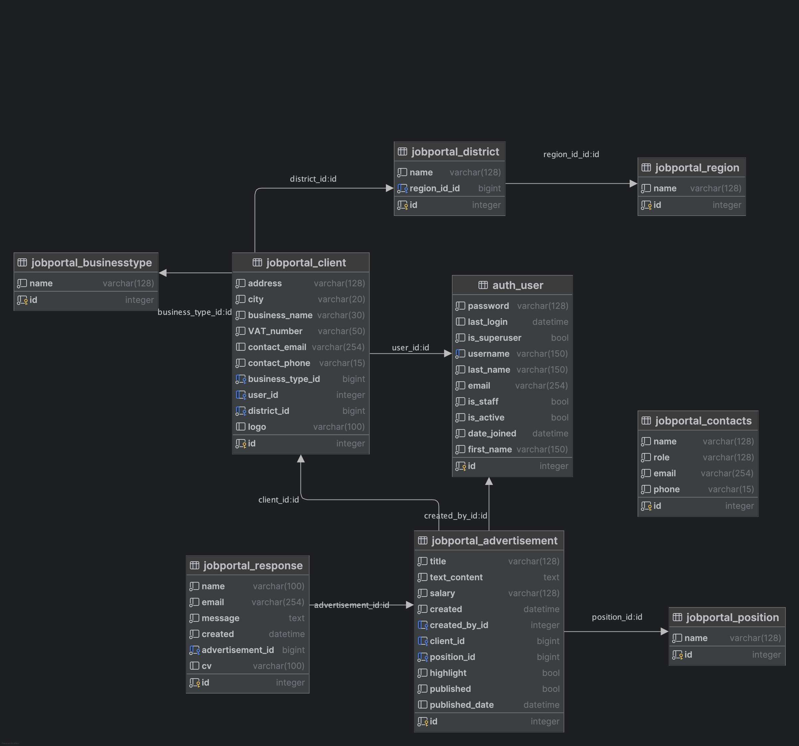

# GASTROBOARD

## Project description:
GASTROBOARD is a web app developed for job searching and recruitment within the gastronomy sector in the Czech Republic. It allows users to browse and apply for job opportunities in their selected regions. Registered users  can post job listings for potential candidates.

This project was created as part of the final examination for the "Python from Scratch" programming course provided by Software Development Academy.

Authors: Juraj Miškolczi, Livia Nowak Abdul, Nicole Taudy

## Project features: 

- [x] client registration, login, password reset, change
- [x] ad detail and handling by client in profile (CRUD)
- [x] ads view on homepage and in client profile 
- [x] ad detail on homepage displayed in modal
- [x] ads filtering by location and position
- [x] applicants inquiry - form submit (plus CV attachment)
- [x] mock payment gateway, purchase confirmation
- [x] ad posting
- [x] ads highlight on front page on request (paid)
- [x] price list view
- [x] applicants responses in client's account
- [x] contact page

## Database:
### Tables
- [x] Client
- [x] Business type
- [x] Advertisement
- [x] Position
- [x] Region
- [x] District
- [x] Contacts

## ERD:
