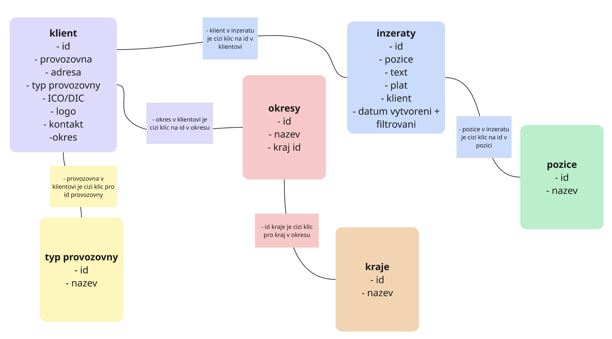

# JOBPORTAL

## Project description:
[jobportal] is a web app developed for job searching and recruitment within the gastronomy sector in the Czech Republic. It allows users to browse and apply for job opportunities in their selected regions. Registered users  can post job listings for potential candidates.

This project was created as part of the final examination for "Python from Scratch" programming course provided by Software Development Academy.

Authors: Juraj Miškolczi, Livia Nowak Abdul, Nicole Taudy

## Project outline: 

- [ ] client registration
- [ ] client login
- [ ] ads handling by client
    - [ ] create
    - [ ] view
    - [ ] edit
    - [ ] delete
- [ ] ads view on homepage
- [ ] ads detail on click
- [ ] ads search and filter by location and position
- [ ] inquiry - form submit (plus attachment)
- [ ] PayPal - mock in user account
- [ ] ad post
- [ ] price list view
- [ ] notification - confirmation of purchase

## Lower priority:
- [ ] job portal info
- [ ] applicants replies in client's account
- [ ] localization
- [ ] ads posting without registration
- [ ] ads highlight on front page on request (paid)

## Databases:

- [ ] Client
   - [ ] business
   - [ ] address
   - [ ] city
   - [ ] district
   - [ ] business type
   - [ ] VAT number 
   - [ ] logo
   - [ ] contact
       - [ ] email
       - [ ] phone number
   

- [ ] Business type
   - [ ] name

- [ ] Advertisement
   - [ ] position
   - [ ] title
   - [ ] text content
   - [ ] salary
   - [ ] client id 
   - [ ] created
 
  
- [ ] Position
    - [ ] name

- [ ] Region
    - [ ] name

- [ ] District
    - [ ] name
    - [ ] region id

   